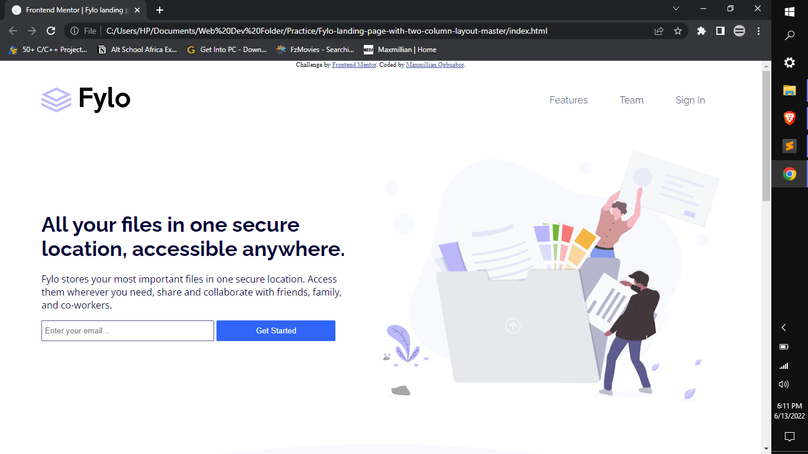

# Frontend Mentor - Fylo landing page with two column layout solution

This is a solution to the [Fylo landing page with two column layout challenge on Frontend Mentor](https://www.frontendmentor.io/challenges/fylo-landing-page-with-two-column-layout-5ca5ef041e82137ec91a50f5). Frontend Mentor challenges help you improve your coding skills by building realistic projects. 

## Table of contents

- [Overview](#overview)
  - [The challenge](#the-challenge)
  - [Screenshot](#screenshot)
  - [Links](#links)
- [My process](#my-process)
  - [Built with](#built-with)
  - [What I learned](#what-i-learned)
  - [Continued development](#continued-development)
- [Author](#author)

## Overview

### The challenge

Users should be able to:

- View the optimal layout for the site depending on their device's screen size
- See hover states for all interactive elements on the page

### Screenshot



### Links

- Solution URL: (https://github.com/C1h2i3d4i5/Fylo-With-two-column-layout)
- Live Site URL: (https://c1h2i3d4i5.github.io/Fylo-With-two-column-layout/)

## My process

### Built with

- Semantic HTML5 markup
- CSS custom properties
- Flexbox
- Mobile-first workflow
- [Font Awesome Icons](https://fontawesome.com/) - Icon Library


### What I learned

I used this challenge as an avenue to einforce what I already know about html and css. I am particularly fond of using the container + row classes to make mobile first workflow easier.

```css
.container{
  margin-left: 70px;
  margin-right: 70px;
}
.row{
  display: flex;
  flex-wrap: wrap;
  align-items: center;
}
```
Using these two is a real help in achieving a mobile-first workflow

### Continued development

I will attempt more challenges to improve my skills

## Author

- Website - [Maxmillian Ogbuabor](https://max-kolbe.maximilianogbua.repl.co/a)
- Twitter - [@kolbe_sama](https://twitter.com/Kolbe_sama)

